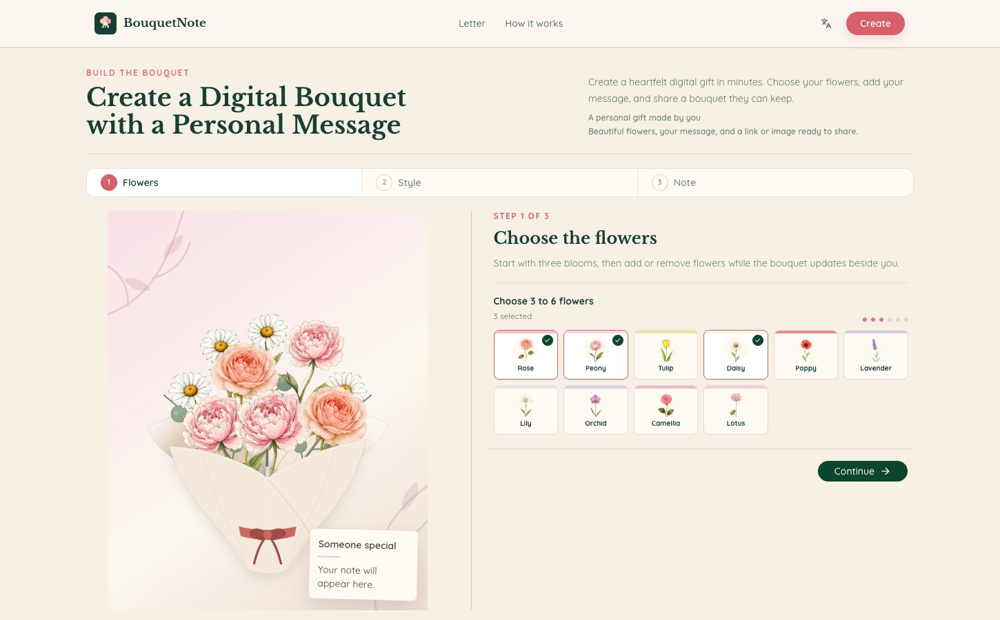

# BouquetNote

### Digital bouquets and letters made to share in a link.

[Open BouquetNote](https://bouquetnote.com/) · [Create a bouquet](https://bouquetnote.com/#create) · [Write a letter](https://bouquetnote.com/letter#create-letter)

BouquetNote is a lightweight web maker for turning a few flowers, a personal note, and a shareable URL into a digital gift. It is for the moments when a text message feels too small, while a physical delivery feels like more work than the occasion needs. Choose a visual direction, write something that sounds like you, and send the finished bouquet or letter wherever the recipient already is.

## See it in action

_Real homepage screenshot from BouquetNote._

## What you can do

- **Bouquet builder** — Choose 3–6 flowers, then shape the arrangement with wrapping, greenery, card style, and atmosphere controls while the preview updates.
- **Digital letter** — Compose a longer letter with a live envelope-and-paper preview, relationship choices, and romantic, warm, funny, or grateful tones.
- **Personal note** — Add the recipient’s name, your name, and a message so the flowers arrive with words that belong to the two of you.
- **Unlisted share link** — Finish a bouquet or letter and create a direct reveal URL that can be sent in a message, email, or social app.
- **High-res PNG download** — Download the finished bouquet or letter as a high-resolution PNG for sending, saving, or printing.
- **Occasion starters** — Begin with a ready-made direction for a birthday, anniversary, thank-you, or Mother’s Day, then change anything you like.

## Explore the workflows

| Workflow | Useful for | Link |
| --- | --- | --- |
| Bouquet builder | Choosing flowers, styling the arrangement, and adding a personal card | [Open the bouquet builder](https://bouquetnote.com/#create) |
| Digital letter | Writing a thoughtful letter with a live preview | [Open the letter maker](https://bouquetnote.com/letter#create-letter) |
| Personal note | Adding the names and message that make a digital gift personal | [Start a bouquet note](https://bouquetnote.com/#create) · [Start a letter](https://bouquetnote.com/letter#create-letter) |
| Unlisted share link | Creating a direct link to the finished reveal | [Create a share link](https://bouquetnote.com/#create) |
| High-res PNG download | Saving a finished design as an image | [Download a bouquet image](https://bouquetnote.com/#create) · [Download a letter image](https://bouquetnote.com/letter#create-letter) |
| Occasion starters | Starting with a prefilled visual direction | [Birthday](https://bouquetnote.com/?occasion=birthday#create) · [Anniversary](https://bouquetnote.com/?occasion=anniversary#create) · [Thank-you](https://bouquetnote.com/?occasion=thank_you#create) · [Mother’s Day](https://bouquetnote.com/?occasion=mothers_day#create) |

The homepage also includes **Get Well** and **Just Because** directions in the bouquet editor. The four links above are the featured occasion starters surfaced on the homepage.

## Example use cases

### Birthdays and milestones

Pair a bright bouquet with a note that remembers a specific moment from the past year, or mark an anniversary with a design that feels more lasting than a one-line greeting.

### Thank-you notes

Name the help, time, advice, or care that mattered. A digital bouquet gives a short thank-you a thoughtful place to arrive.

### Mother’s Day and family moments

Start with a soft seasonal direction, then write the detail your mother or family member will recognize as yours.

### Love letters

Turn one shared memory, an everyday observation, or a future plan into a letter with a gentle reveal and a keepsake image.

### Long-distance friendship

Send a bouquet or letter when a friend is far away, reconnecting, celebrating a quiet win, or simply on your mind.

### Small moments worth keeping

There does not have to be an occasion. A Just Because bouquet can carry a simple reminder that someone is cared for.

## Ready-to-use message examples

Copy a starting point, then replace the general details with something only you and the recipient would recognize:

[Browse the message examples](examples/messages.md) — birthday, anniversary, thank-you, Mother’s Day, love letter, and letter to a friend.

> I kept thinking about the way you made this year feel lighter. I hope the next chapter gives you more slow mornings, good surprises, and time for the things that make you feel most like yourself.

> Thank you for showing up when I needed it, especially in the small practical ways. I noticed, it helped more than I said at the time, and I will remember it.

## Sharing model

BouquetNote gifts are **unlisted by link**. They are not placed in a public gallery or included as individual gift pages in the site sitemap. Gift pages use `noindex` directives to discourage search engines from listing them, but `noindex` is not access control: anyone who receives or discovers the link may be able to open it.

The current creator UI does not expose password-protected links, so this repository does not advertise password protection. BouquetNote does not claim end-to-end encryption or account-based authentication for recipient access. Do not use an unlisted link as a substitute for a secure channel when a message is highly sensitive.

Recipients can open a shared gift in a regular browser without installing an app or creating an account. Image downloads are performed in the browser and stay on the device that downloads them.

## About this repository

This repository contains public product documentation, copyable message examples, and media for BouquetNote. It does **not** contain the private application source code, deployment configuration, API keys, secrets, database contents, or user data. The private implementation is maintained separately.

The ready-to-upload [`assets/bouquetnote-social-cover.jpg`](assets/bouquetnote-social-cover.jpg) is sized at 1200×630 for GitHub's social preview. Its self-contained [`assets/social-cover.html`](assets/social-cover.html) source uses only inline CSS and SVG.

Use the product at [bouquetnote.com](https://bouquetnote.com/). For product policies, see the [Privacy Policy](https://bouquetnote.com/privacy-policy) and [Terms of Service](https://bouquetnote.com/terms-of-service).

## Suggested GitHub topics

`digital-gift` · `digital-bouquet` · `virtual-flowers` · `digital-letter` · `love-letter`
